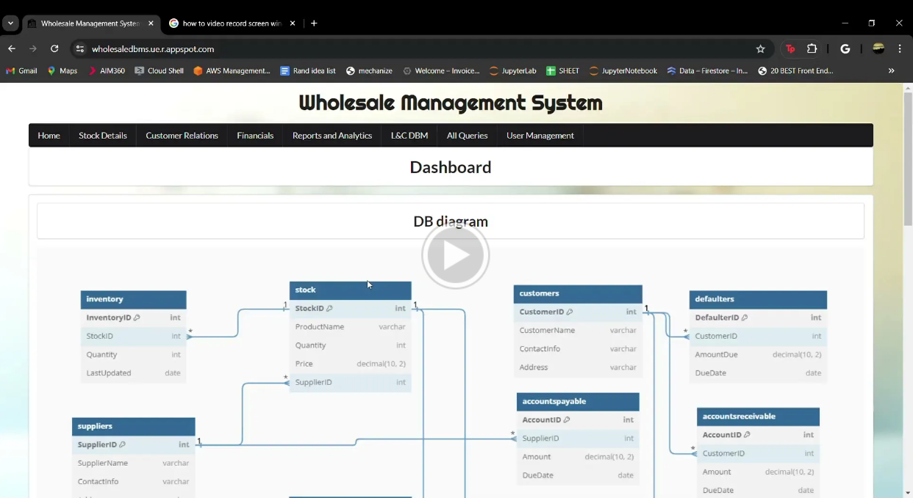

# WholeSale Database Mangagement System

This project is a wholesale database management system. It's a system designed to deliver an information system solution for a large-scale industry that requires fast and reliable communication between departments. Seamless integration between department requirements is crucial for a successful wholesale retailer. All departments should be able to directly add and remove information from the Information System as the business requirements change through time.

Public URL: [https://wholesaledbms.ue.r.appspot.com//](https://wholesaledbms.ue.r.appspot.com/)

## Critical departments and Business requirements:
1. A customer service department is needed to assist customers, fulfill demand, and keep track of relations. Some requirements for a department might be to manage and place customer orders, keep track of defaulters, and potentially track outstanding receivables to know who's in good standing or not.
2. A Procurement department is needed to manage inventory levels and maintain supplier relations. Requirements may include the need to keep track of product / stock information such as how many units come per order and how much per unit, and who's the supplier. To have successful tracking of products inventory levels for the products offered must be measured, and supplier information and contact info saved. Reports for the supplier department may allow the procurement department to quickly view inventory levels, supplier diversity and make tactical business decisions quickly and efficiently.
3. The financial wellness of a wholesale company is important to the outlook and future of the company. Giving the finance department as well as management a direct view into the companies real time accounts receivable, account payable and inbound profit allows the company to make strategic decisions to market changes that other companies without this Information system cannot make. Offering real time charts and graphs for the finance department gives management and the finance department a quick overview of the performance of the company.
4. The warehouse department who manages and facilitates the movement of inventory needs real time reports of inbound inventory, inbound profit, and even when and if client orders need to be fulfilled. 

To achieve and fulfill the business requirements of a Wholesaler, a Database management system would need to integrate all of the departments roles and needs as well as provide a quick way to communicate with the rest of the company. A successful Information system can lead to a successful wholesale company.

## Technologies used:

- Node.js
- Express.js
- MySQL
- EJS (An easy template engine)
- Google App Engine (To deploy the application)
- Google Cloud SQL (To host the database)

## How to run the project:

1. Clone the repository (git clone [github.com/DBMclassProd/wholesaleDB](https://github.com/KevinFloris20/wholesaleDBMS.git))
2. Download all of the dependencies (npm install or npm installAllThings)
3. Add your own database credentials in the .env file
    Details:
    - touch cred.env //do this in in the root dir
    - //Add these lines:
    - //local database
    - DB_HOST=localhost
    - DB_USER=root
    - DB_PASS=********
    - DB_NAME=********
    - // cloud db
    - GDB_HOST=********
    - GDB_USER=********
    - GDB_PASS=********
    - GDB_NAME=********
4. Run the project (node server.js or npm start)
5. Open the browser and go to port 8080, localhost:8080

## Finished Product Overview:

